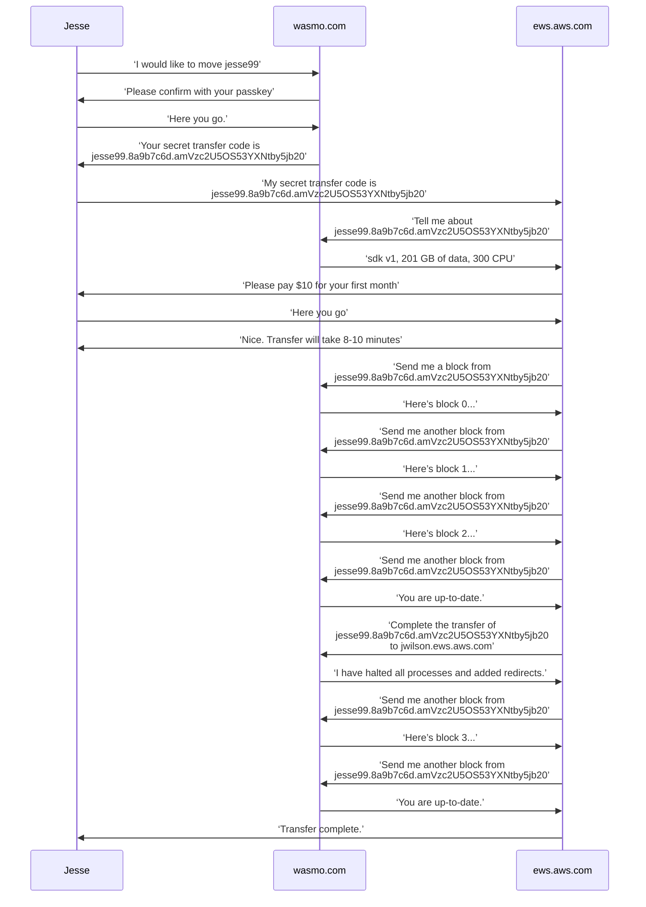

Host Migrations
---------------

We need to build a mechanism to move house: a user moves from say, wasmo.com to Homelab Wasmo or
Amazon EWS (Elastic Wasmo Service!) or vice versa.

This should be an online process, where the old and new host coordinate the move on the user’s
behalf.

Redirects
---------

We should do HTTP redirects for a grace period like 3 months. Perhaps users can purchase redirects
at some low price, like $10 per year.

It must be redirects only. We can’t point our DNS names at the recipient’s host because it would
leak the source’s secret cookies to the target server.

